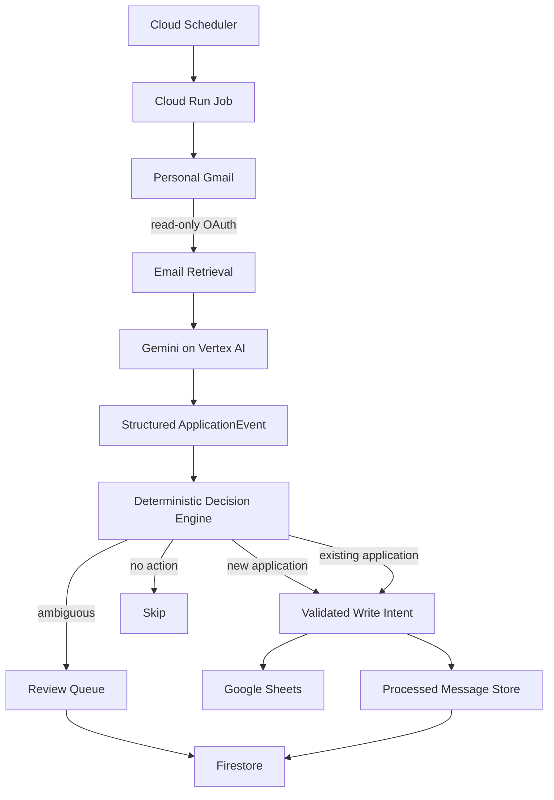

# Job Application Tracker 

A privacy-conscious automation that monitors job-application emails, extracts structured application events with Gemini, reconciles them against an existing application tracker, and safely updates Google Sheets.

The system is designed around a strict separation of responsibilities:

> **Gemini interprets --> Python decides, validates, AND THEN writes.**

LLM output is never allowed to directly modify persistent state as it is non-deterministic.

## Overview

Job application updates arrive across many different email formats: confirmations, assessments, interview invitations, rejections, and offers. Manually keeping a tracker synchronized with those emails is super boring and easy to neglect.

This project automates that workflow while preserving deterministic control over matching and writes.

```text
Gmail
  ↓
Email retrieval
  ↓
Gemini / Vertex AI
  ↓
Structured ApplicationEvent
  ↓
Deterministic Python decision engine
  ↓
┌──────────────────┬──────────────────┐
│ Google Sheets    │ Firestore        │
│ application data │ durable state    │
└──────────────────┴──────────────────┘
```

The production workload runs as a scheduled, one-shot Cloud Run Job rather than a continuously running service.

## What It Does

The agent:

* reads recent Gmail messages using read-only OAuth
* extracts structured job-application events using Gemini through Vertex AI
* normalizes company and role names
* performs deterministic application matching
* distinguishes new applications from updates to existing applications
* routes ambiguous cases to a review queue instead of guessing
* writes validated changes to Google Sheets
* records processed-message state in Firestore
* emits structured operational events for monitoring and debugging

Typical extracted events include:

```text
application confirmation
assessment
interview
rejection
offer
other
```

## Architecture



### Responsibility boundaries

The LLM is responsible only for interpreting unstructured email content.

It does **not**:

* choose which tracker row to update
* decide whether fuzzy matches are safe
* create or update spreadsheet rows directly
* mark messages as processed
* resolve ambiguous cases
* access write APIs directly

Those actions are controlled by deterministic Python logic.

## Safety Design

The project intentionally fails closed when uncertainty or persistence problems occur.

### Ambiguous matches

```text
ambiguous
→ REVIEW

not
→ guess
```

Multiple plausible application matches are never automatically resolved.

### Persistence failures

```text
durable persistence failure
→ operation fails
→ message remains unprocessed
→ eligible for retry
```

A message is not marked as successfully processed unless required durable state has been written.

### Extraction failures

A single malformed or unparseable email does not stop the entire batch.

```text
extraction failure
→ no spreadsheet write
→ message remains unprocessed
→ continue processing remaining messages
```

### Write controls

Write behavior is explicitly configured and validated at startup.

Malformed boolean configuration causes startup validation to fail, while low-level write gates remain fail-closed.

Interactive writes are disabled by default.

## OAuth and Identity Boundaries

The system deliberately separates user OAuth from Google Cloud service identity.

### Gmail

Gmail uses:

```text
https://www.googleapis.com/auth/gmail.readonly
```

The application never requests Gmail permissions for:

```text
send
compose
modify
delete
label
```

### Google Sheets

Sheet reading and writing use separate OAuth credentials.

Read access:

```text
https://www.googleapis.com/auth/spreadsheets.readonly
```

Write access:

```text
https://www.googleapis.com/auth/spreadsheets
```

### Google Cloud

Vertex AI and Firestore use Application Default Credentials through the Cloud Run runtime service account.

No service-account JSON keys are required in production.

## Project Structure

```text
.
├── main.py
├── src/
│   ├── config.py
│   ├── decision_engine.py
│   ├── extraction.py
│   ├── gmail_client.py
│   ├── matching.py
│   ├── normalization.py
│   ├── oauth_credentials.py
│   ├── processed_messages.py
│   ├── review_queue.py
│   ├── schemas.py
│   ├── sheet_writer.py
│   ├── sheets_client.py
│   ├── tracker_reader.py
│   ├── tracker_schema.py
│   └── write_models.py
├── scripts/
│   ├── verify_sheets_write.py
│   └── verify_sheets_write_auth.py
├── tests/
├── docs/
│   └── production_runbook.md
├── Dockerfile
├── pyproject.toml
└── uv.lock
```

## Key Components

### Extraction

`src/extraction.py`

Uses Gemini through Vertex AI to transform an email into a validated `ApplicationEvent`.

The model is asked to interpret the message, not make persistence decisions.

### Matching

`src/matching.py`

Matches extracted companies and roles against existing tracker rows using normalized text and controlled fuzzy matching.

### Decision Engine

`src/decision_engine.py`

Determines whether an event should result in:

```text
NEW_APPLICATION
EXISTING_UPDATE
AMBIGUOUS
NO_ACTION
```

This layer is deterministic.

### Write Models

`src/write_models.py`

Converts decisions into validated write intents before any spreadsheet modification occurs.

### Persistence

Firestore stores:

```text
processed_messages
review_queue
```

This allows Cloud Run executions to remain stateless while preserving retry and deduplication behavior across runs.

## Production Execution

Production runs as:

```text
Cloud Scheduler
→ Cloud Run Job
→ Gmail / Google Sheets OAuth
→ Vertex AI
→ deterministic decision engine
→ Google Sheets / Firestore
→ exit
```

Cloud Run is used as a **Job**, not an HTTP server.

The workload executes on a schedule and exits when the batch completes.

## Observability

The application emits structured events such as:

```text
run_started
run_succeeded
run_failed
message_extracted
extraction_failed
message_skipped_already_processed
decision_made
write_intent_prepared
decision_handling_failed
```

Production monitoring covers:

* Cloud Run execution failures
* repeated extraction failures
* scheduler invocation failures

Sensitive email subjects, sender addresses, message bodies, OAuth credentials, and tracker contents are not intentionally included in structured application logs.

## Configuration

Configuration is provided through environment variables and mounted OAuth credentials.

Representative variables include:

```text
GOOGLE_CLOUD_PROJECT
GOOGLE_CLOUD_LOCATION

TRACKER_SPREADSHEET_ID

PROCESSED_MESSAGE_BACKEND

AUTO_WRITE
ALLOW_INTERACTIVE_WRITES
ALLOW_INTERACTIVE_OAUTH
PERSIST_OAUTH_TOKENS
```

Production identifiers and credentials are intentionally not included in this repository.

Boolean deployment configuration is validated at startup to catch malformed values before processing begins.

## Local Development

The project uses Python 3.13 and `uv`.

Install dependencies:

```bash
uv sync
```

Run the application:

```bash
uv run python main.py
```

Run the test suite:

```bash
uv run python -m pytest -q
```

OAuth credentials and local tokens must be supplied separately and are excluded from Git and Docker build context.

## Testing

The test suite covers the deterministic parts of the system, including:

* decision logic
* application matching
* extraction configuration
* orchestration behavior
* processed-message persistence
* review queue behavior
* spreadsheet write intents
* configuration validation

The highest-value invariant under test is that uncertain or malformed input cannot silently become an unintended write.

## Deployment

The production image is built with Docker and deployed as a Cloud Run Job.

Secrets are mounted at runtime rather than embedded in the image.

A scheduled Cloud Scheduler invocation triggers the job periodically during configured operating hours.

The deployment model keeps the application:

* ephemeral
* stateless between executions
* easy to retry
* easy to monitor
* inexpensive when idle

## Privacy

This repository is designed to be safe to publish without exposing operational credentials.

The repository does not intentionally contain:

* Gmail OAuth tokens
* Google Sheets OAuth tokens
* OAuth client secrets
* raw email bodies
* personal email addresses
* spreadsheet IDs
* service-account private keys
* production message contents

Local credential files and generated state are excluded through `.gitignore` and `.dockerignore`.

## Engineering Decisions

A few design choices are deliberate.

**Why not let the LLM update the tracker directly?**

Because interpretation and mutation have different risk profiles. Gemini handles semantic extraction; deterministic code controls matching and persistence.

**Why Firestore instead of a local JSON file in production?**

Cloud Run Jobs are ephemeral. Firestore provides durable shared state across executions and avoids dependence on container-local storage.

**Why separate Sheets read and write credentials?**

It minimizes privilege and makes write access explicit.

**Why use a Cloud Run Job instead of a web service?**

The application performs finite scheduled batch work and does not need to serve HTTP traffic continuously.

**Why keep ambiguous cases?**

A wrong automatic update is more costly than requiring manual review.

## Tech Stack

```text
Python 3.13
Gemini / Vertex AI
Google Gmail API
Google Sheets API
Google Cloud Firestore
Google Cloud Run Jobs
Google Cloud Scheduler
Pydantic
RapidFuzz
Docker
pytest
uv
